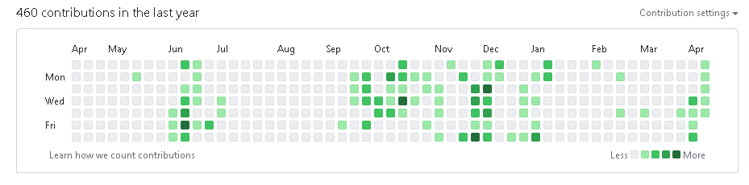

## 个人信息 

* 性 别：男&emsp;&emsp;&emsp;&emsp;&emsp;&emsp;&emsp;&emsp;年 龄：21  
* 手 机：15860642256 &emsp;&emsp;&emsp;  邮 箱：2256834434@qq.com    
* 专 业：数字媒体技术 &emsp;&emsp;&emsp; 岗 位：web开发,软件开发

## 工作及教育经历

* 福州大学&emsp;&emsp;&emsp;&emsp;&emsp;2020.9~至今&emsp;&emsp; 数字媒体技术-本科  

## 专业技能

* 初步掌握 Java、C、C++，了解 Python、PHP、JS、JSP等编程语言
* 安卓开发、springboot、socket、react、mongodb、heroku等技术，前后端均有涉猎
* 初步掌握基础数据结构和算法的基本原理
* 熟练使用 Vim

## 项目经历

1. 学校 - 各种项目作业 - 独立开发   
    * [GitHub仓库地址](https://github.com/wadeoo?tab=repositories)
    * github最近一年提交记录
    

## 获奖经历

* 竞赛: 全国大学生英语竞赛C类二等奖

## 个人账号 

* [个人网站](https://wadeoo.github.io/)
* [GitHub](https://github.com/wadeoo)

## 其他信息 

* 乐意学习新技术, 擅长融会贯通, 举一反三
* 熟练使用chatgpt
* 六级603
* 健身, 性格乐观，沉得住气 